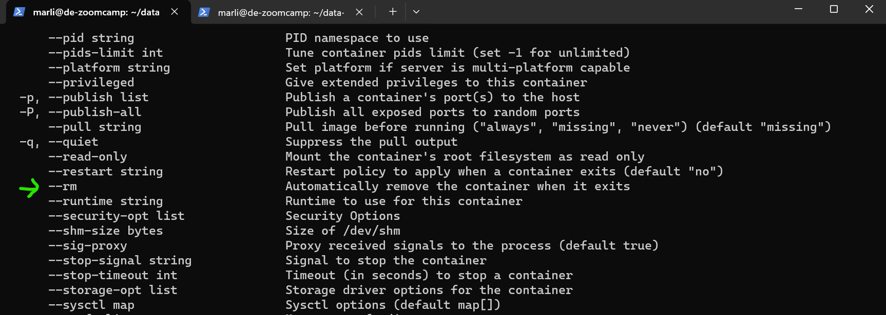
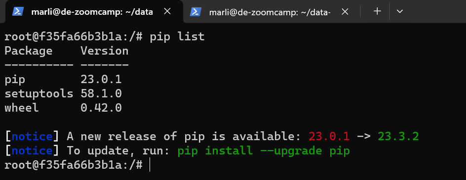
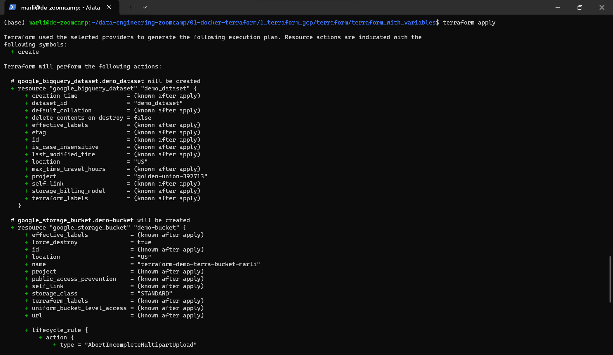
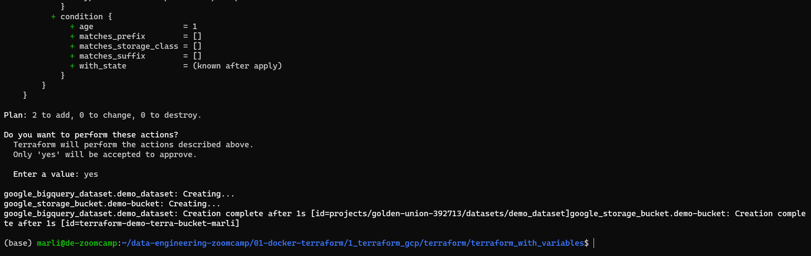

# Module 1 Homework Solution

## Question 1: Knowing Docker Tags
- **Answer:** `--rm`



## Question 2: Understanding Docker First Run 
- **Answer:** `0.42.0` 

**Command:**
```bash
docker run -it --entrypoint /bin/bash python:3.9
pip list
```



## Question 3: Count Records
- **Answer:** 15612

```sql
root@localhost:ny_taxi> SELECT COUNT(*)
FROM green_tripdata_2019
WHERE (DATE(lpep_pickup_datetime) = '2019-09-18')
  AND (DATE(lpep_dropoff_datetime) = '2019-09-18');

+-------+
| count |
|-------|
| 15612 |
+-------+
SELECT 1
Time: 0.050s
```


## Question 4. Largest trip for each day
- **Answer:** 2019-09-26
```sql
root@localhost:ny_taxi> SELECT lpep_pickup_datetime FROM green_tripdata_2019 WHERE trip_distance = (SELECT MAX(trip_distance) FROM green_tripdata_2019) ;
+----------------------+
| lpep_pickup_datetime |
|----------------------|
| 2019-09-26 19:32:52  |
+----------------------+
SELECT 1
Time: 0.096s
```

## Question 5. Three biggest pick up Boroughs
- **Answer:** "Brooklyn", "Manhattan", and "Queens"
```sql
root@localhost:ny_taxi> SELECT t2.borough
 FROM green_tripdata_2019 t1
 LEFT JOIN taxi_and_zone_lookup t2
     ON t1."pu_location_id" = t2."location_id"
 WHERE DATE(lpep_pickup_datetime) = '2019-09-18'
 GROUP BY borough
 HAVING SUM(t1.total_amount) > 50000;
+-----------+
| borough   |
|-----------|
| Brooklyn  |
| Manhattan |
| Queens    |
+-----------+
SELECT 3
Time: 0.056s
```

## Question 6. Largest tip
- **Answer:** JFK Airport
```sql
root@localhost:ny_taxi> SELECT t2.zone, t1.tip_amount FROM green_tripdata_2019 t1 LEFT JOIN taxi_and_zone_lookup t2 ON t1."do_location_id" = t2."location_id" WHERE E
 XTRACT(YEAR FROM lpep_pickup_datetime) = 2019 AND EXTRACT(MONTH FROM lpep_pickup_datetime) = 9 AND t1.pu_location_id = (SELECT location_id FROM taxi_and_zone_lookup
  WHERE zone='Astoria') ORDER BY t1.tip_amount DESC LIMIT 5 ;
+-------------+------------+
| zone        | tip_amount |
|-------------+------------|
| JFK Airport | 62.31      |
| Woodside    | 30.0       |
| Kips Bay    | 28.0       |
| NV          | 25.0       |
| Astoria     | 20.0       |
+-------------+------------+
SELECT 5
Time: 0.523s
root@localhost:ny_taxi> SELECT t2.zone FROM green_tripdata_2019 t1 LEFT JOIN taxi_and_zone_lookup t2 ON t1."do_location_id" = t2."location_id" WHERE EXTRACT(YEAR FRO
 M lpep_pickup_datetime) = 2019 AND EXTRACT(MONTH FROM lpep_pickup_datetime) = 9 AND t1.pu_location_id = (SELECT location_id FROM taxi_and_zone_lookup WHERE zone='As
 toria') ORDER BY t1.tip_amount DESC LIMIT 1 ;
+-------------+
| zone        |
|-------------|
| JFK Airport |
+-------------+
SELECT 1
Time: 0.535s
```

## Question 7. Creating Resources
- **Answer:**
```bash
(base) marli@de-zoomcamp:~/data-engineering-zoomcamp/01-docker-terraform/1_terraform_gcp/terraform/terraform_with_variables$ terraform apply

Terraform used the selected providers to generate the following execution plan. Resource actions are indicated with the
following symbols:
  + create

Terraform will perform the following actions:

  # google_bigquery_dataset.demo_dataset will be created
  + resource "google_bigquery_dataset" "demo_dataset" {
      + creation_time              = (known after apply)
      + dataset_id                 = "demo_dataset"
      + default_collation          = (known after apply)
      + delete_contents_on_destroy = false
      + effective_labels           = (known after apply)
      + etag                       = (known after apply)
      + id                         = (known after apply)
      + is_case_insensitive        = (known after apply)
      + last_modified_time         = (known after apply)
      + location                   = "US"
      + max_time_travel_hours      = (known after apply)
      + project                    = "golden-union-392713"
      + self_link                  = (known after apply)
      + storage_billing_model      = (known after apply)
      + terraform_labels           = (known after apply)
    }

  # google_storage_bucket.demo-bucket will be created
  + resource "google_storage_bucket" "demo-bucket" {
      + effective_labels            = (known after apply)
      + force_destroy               = true
      + id                          = (known after apply)
      + location                    = "US"
      + name                        = "terraform-demo-terra-bucket-marli"
      + project                     = (known after apply)
      + public_access_prevention    = (known after apply)
      + self_link                   = (known after apply)
      + storage_class               = "STANDARD"
      + terraform_labels            = (known after apply)
      + uniform_bucket_level_access = (known after apply)
      + url                         = (known after apply)

      + lifecycle_rule {
          + action {
              + type = "AbortIncompleteMultipartUpload"
            }
          + condition {
              + age                   = 1
              + matches_prefix        = []
              + matches_storage_class = []
              + matches_suffix        = []
              + with_state            = (known after apply)
            }
        }
    }

Plan: 2 to add, 0 to change, 0 to destroy.

Do you want to perform these actions?
  Terraform will perform the actions described above.
  Only 'yes' will be accepted to approve.

  Enter a value: yes

google_bigquery_dataset.demo_dataset: Creating...
google_storage_bucket.demo-bucket: Creating...
google_bigquery_dataset.demo_dataset: Creation complete after 1s [id=projects/golden-union-392713/datasets/demo_dataset]google_storage_bucket.demo-bucket: Creation complete after 1s [id=terraform-demo-terra-bucket-marli]
```


- Screenshot:


