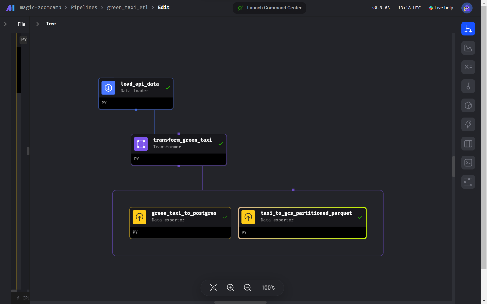
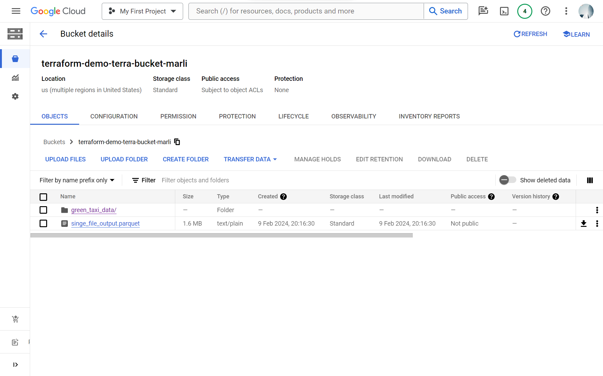
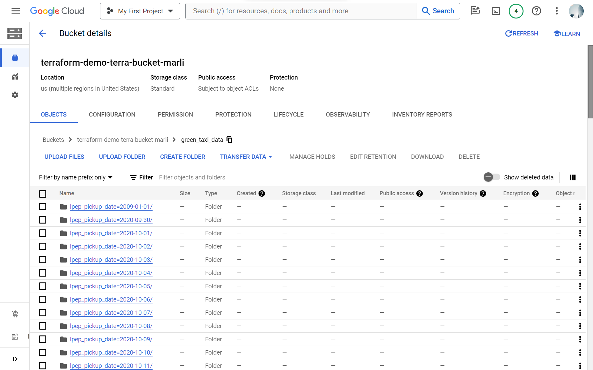

# Homework Week 2

## Assignment (Some Screenshots)
All Mage-AI assignments are located within the following directory: `/data-engineering-zoomcamp/02-workflow-orchestration/mage-zoomcamp`.

- Mage Platform
  

- The pipeline
  

- The loaded data
  

- The loaded data (partitioned parquet)
  

## Questions

### Question 1:

Once the dataset is loaded, what's the shape of the data?

```python
df.shape
>> (266855, 20)
```

### Question 2:

Upon filtering the dataset where the passenger count is greater than 0 and the trip distance is greater than zero, how many rows are left?

```python
len(df)
>> 139370
```

### Question 3:

Which of the following creates a new column lpep_pickup_date by converting `lpep_pickup_datetime` to a date?

```python
data['lpep_pickup_date'] = data['lpep_pickup_datetime'].dt.date
```

### Question 4:

What are the existing values of VendorID in the dataset?

```python
df['vendor_id'].unique()
>> <IntegerArray>
>> [2, 1]
>> Length: 2, dtype: Int64

```

### Question 5:

How many columns need to be renamed to snake case?

> 4 columns

### Question 6:

Once exported, how many partitions (folders) are present in Google Cloud?

> 95
